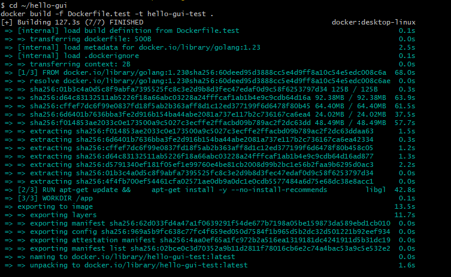

# 🎨 CI/CD на Go GUI (Fyne) с публикацией бинарников в GitHub Releases

📦 Сборка Go GUI в один исполняемый файл через **Fyne**.

- 🪟 **Fyne** — самая популярная библиотека GUI на Go. Кроссплатформенная, чистый Go с минимальным CGO.
- 🏷️ **GitHub Releases** — раздел репозитория для публикации версий (теги + файлы).

🎯 **Цель:** автоматически собирать GUI-бинарники Go под Linux, macOS и Windows и публиковать их в GitHub Releases при push тега `v*`.

🔍 **Ключевое отличие от Go CLI:**
- ⚡ Go CLI — один runner собирает под все платформы (cross-compilation)
- 🖼️ Go GUI — CGO требует нативный компилятор под каждую ОС → **3 runner'а**, как у Python

> 💡 **Главный урок:** `CGO_ENABLED=1` ломает cross-compilation. Как только приложению нужны нативные библиотеки (OpenGL, X11, Wayland, WebKit), один runner уже не справится.

📚 **Что узнаете:**
- 🪟 Fyne — виджеты, окна, контейнеры
- 📦 `go mod tidy` — управление зависимостями и `go.sum`
- 🔧 CGO — зачем нужен и как влияет на CI
- 🖥️ GLFW — низкоуровневая библиотека для окон, компилируется из C
- 🐧 X11 и Wayland — два графических протокола Linux, оба нужны GLFW
- 🪟 MSYS2 — современный способ установки GCC для CGO на Windows
- 🔍 Динамический поиск gcc — почему нельзя хардкодить путь на Windows
- ⚡ Cross-compilation для GUI — почему она сложнее, чем для CLI
- 🔀 Матричные сборки в GitHub Actions — 3 ОС параллельно
- 🐳 `Dockerfile.test` — вынесение GUI-зависимостей из `docker run` в образ
- 🪟 `-H windowsgui` — скрытие консольного окна на Windows
- 🚀 `softprops/action-gh-release` — публикация артефактов

---

## 1. 🗂️ Структура проекта

```text
hello-gui/
├── .github/workflows/ci.yml
├── Dockerfile.test
├── logic.go
├── logic_test.go
├── main.go
├── go.mod
├── go.sum          ← появляется после go mod tidy (шаг 2.5)
└── .gitignore
```

> ⚠️ `go.sum` появляется **после** команды `go mod tidy` из шага 2.5. Это файл, который **обязательно коммитится** в репозиторий — без него CI упадёт с ошибкой `missing go.sum entry`.

```shell
cd ~
mkdir -p hello-gui/.github/workflows && \
cd hello-gui && \

cat > go.mod << 'EOF'
module hello-gui

go 1.23
EOF

cat > logic.go << 'EOF'
package main

import "fmt"

// Greeting возвращает приветствие для указанного имени.
func Greeting(name string) string {
	return fmt.Sprintf("Hello, %s!", name)
}

// SumRange считает сумму чисел от from до to включительно.
func SumRange(from, to int) int {
	sum := 0
	for i := from; i <= to; i++ {
		sum += i
	}
	return sum
}
EOF

cat > logic_test.go << 'EOF'
package main

import "testing"

func TestGreeting(t *testing.T) {
	got := Greeting("Fyne")
	want := "Hello, Fyne!"
	if got != want {
		t.Errorf("Greeting() = %q, want %q", got, want)
	}
}

func TestSumRange(t *testing.T) {
	got := SumRange(1, 10)
	want := 55
	if got != want {
		t.Errorf("SumRange(1, 10) = %d, want %d", got, want)
	}
}
EOF

cat > main.go << 'EOF'
package main

import (
	"fmt"

	"fyne.io/fyne/v2/app"
	"fyne.io/fyne/v2/container"
	"fyne.io/fyne/v2/widget"
)

// version перезаписывается через -ldflags "-X main.version=..." во время сборки.
var version = "dev"

func main() {
	a := app.New()
	w := a.NewWindow("Hello GUI " + version)

	output := widget.NewLabel("Нажмите кнопку ниже")

	greetBtn := widget.NewButton("Поздороваться", func() {
		output.SetText(Greeting("GitHub"))
	})

	quitBtn := widget.NewButton("Выход", func() {
		a.Quit()
	})

	w.SetContent(container.NewVBox(
		widget.NewLabel("Hello from Go GUI! 🎨🐹"),
		widget.NewSeparator(),
		greetBtn,
		output,
		widget.NewSeparator(),
		widget.NewLabel(fmt.Sprintf("Version: %s", version)),
		widget.NewLabel(fmt.Sprintf("Sum 1..10 = %d", SumRange(1, 10))),
		widget.NewSeparator(),
		quitBtn,
	))

	w.ShowAndRun()
}
EOF

cat > Dockerfile.test << 'EOF'
# Тестовый образ для Go GUI (Fyne)
# Содержит GUI-зависимости, нужные для сборки и тестов Fyne на Linux.
FROM golang:1.23

RUN apt-get update && \
    apt-get install -y --no-install-recommends \
        libgl1-mesa-dev \
        libegl1-mesa-dev \
        xorg-dev \
        libwayland-dev \
        libxkbcommon-dev \
        wayland-protocols && \
    rm -rf /var/lib/apt/lists/*

WORKDIR /app
EOF

cat > .gitignore << 'EOF'
/hello-gui
/hello-gui-*
.env
.idea/
.vscode/
*.iml
EOF

echo "✅ Структура создана:"
find . -type f | sort
```

> 💡 В `go.mod` **нет** строки `require fyne.io/fyne/v2 ...`. Её добавит `go mod tidy` вместе с `go.sum`. Стандартный путь в Go: `go mod init` → код → `go mod tidy`.

---

## 2. ⚙️ `.github/workflows/ci.yml`

```yaml
name: Go GUI CI/CD

on:
  push:
    branches: [ main ]
    tags: [ 'v*' ]
  pull_request:

jobs:
  test:
    runs-on: ubuntu-latest

    steps:
      - uses: actions/checkout@v4

      - name: Setup Go
        uses: actions/setup-go@v5
        with:
          go-version: '1.23'
          cache: true

      - name: Install GUI dependencies (Linux)
        run: |
          sudo apt-get update
          sudo apt-get install -y \
            libgl1-mesa-dev \
            libegl1-mesa-dev \
            xorg-dev \
            libwayland-dev \
            libxkbcommon-dev \
            wayland-protocols

      - name: Format check
        run: |
          UNFORMATTED=$(gofmt -l .)
          if [ -n "$UNFORMATTED" ]; then
            echo "❌ Не отформатировано:"
            echo "$UNFORMATTED"
            echo "Запустите локально: gofmt -w ."
            exit 1
          fi

      - name: Lint with go vet
        run: go vet ./...

      - name: Run tests
        run: go test ./... -v

      - name: Build (smoke check)
        run: go build -o /tmp/hello-gui .

  release:
    needs: test
    if: startsWith(github.ref, 'refs/tags/v')
    permissions:
      contents: write

    strategy:
      matrix:
        include:
          - os: ubuntu-latest
            artifact: hello-gui-linux-x64
            extra_ldflags: ""
          - os: macos-14
            artifact: hello-gui-macos-arm64
            extra_ldflags: ""
          - os: windows-latest
            artifact: hello-gui-windows-x64.exe
            extra_ldflags: "-H windowsgui"

    runs-on: ${{ matrix.os }}

    steps:
      - uses: actions/checkout@v4

      - name: Setup Go
        uses: actions/setup-go@v5
        with:
          go-version: '1.23'
          cache: true

      - name: Install GUI dependencies (Linux)
        if: runner.os == 'Linux'
        run: |
          sudo apt-get update
          sudo apt-get install -y \
            libgl1-mesa-dev \
            libegl1-mesa-dev \
            xorg-dev \
            libwayland-dev \
            libxkbcommon-dev \
            wayland-protocols

      - name: Setup MSYS2 (Windows)
        if: runner.os == 'Windows'
        uses: msys2/setup-msys2@v2
        with:
          msystem: MINGW64
          update: true
          install: >-
            mingw-w64-x86_64-gcc
            mingw-w64-x86_64-pkg-config

      - name: Set CC for Windows
        if: runner.os == 'Windows'
        shell: pwsh
        run: |
          $gccPath = Join-Path $env:RUNNER_TEMP "msys64\mingw64\bin\gcc.exe"
          if (-not (Test-Path $gccPath)) {
            $gccPath = "C:\msys64\mingw64\bin\gcc.exe"
          }
          if (-not (Test-Path $gccPath)) {
            $found = Get-ChildItem -Path $env:RUNNER_TEMP -Filter "gcc.exe" -Recurse -ErrorAction SilentlyContinue |
                     Where-Object { $_.FullName -like "*mingw64*" } |
                     Select-Object -First 1
            if ($found) { $gccPath = $found.FullName }
          }
          if (-not (Test-Path $gccPath)) {
            throw "gcc.exe not found. Checked: $gccPath"
          }
          Write-Host "Found gcc at: $gccPath"
          $gccUnix = $gccPath -replace '\\', '/'
          $gccDir = (Split-Path $gccPath -Parent) -replace '\\', '/'
          echo "CC=$gccUnix" >> $env:GITHUB_ENV
          echo "$gccDir" >> $env:GITHUB_PATH

      - name: Build GUI binary
        shell: bash
        env:
          CGO_ENABLED: 1
        run: |
          go build \
            -ldflags="-s -w ${{ matrix.extra_ldflags }} -X main.version=${{ github.ref_name }}" \
            -o ${{ matrix.artifact }} .

      - name: Upload to Release
        uses: softprops/action-gh-release@v2
        with:
          files: ${{ matrix.artifact }}
          generate_release_notes: true
```

---

## 2.5. 🐳 Сборка тестового образа с GUI-зависимостями

GUI-зависимости Fyne требуют **root** для установки, но запускать тесты от root — плохо (файлы на хосте будут принадлежать root).

**Решение:** соберём образ один раз, тесты запустим от своего UID.

```shell
cd ~/hello-gui
docker build -f Dockerfile.test -t hello-gui-test .
```

✅ Ожидаемый вывод:
```
[+] Building 49.6s (7/7) FINISHED
 => [internal] load build definition from Dockerfile.test
 ...
 => => naming to docker.io/library/hello-gui-test
```

> 💡 **Почему так много пакетов?** Fyne использует **GLFW** — библиотеку для окон, компилируемую из C через CGO. GLFW поддерживает два графических протокола Linux:
>
> - 🐧 **X11** — `xorg-dev`
> - 🌊 **Wayland** — `libwayland-dev`, `wayland-protocols`, `libxkbcommon-dev`
> - 🎨 **OpenGL/EGL** — `libgl1-mesa-dev`, `libegl1-mesa-dev`
>
> Не хватает одного — компиляция GLFW падает с `fatal error: ... .h: No such file or directory`.
>
> **Этот образ только для тестов и локальной сборки.** В GitHub Actions он не нужен — там `apt-get` ставится через `sudo`.

---

## 2.6. 📦 Генерация `go.sum`

```shell
cd ~/hello-gui
docker run --rm \
  -u "$(id -u):$(id -g)" \
  -e HOME=/tmp \
  -e GOPATH=/tmp/go \
  -e GOCACHE=/tmp/go-cache \
  -v "$(pwd)":/app \
  -v ~/.go-docker-cache:/tmp/go \
  -w /app \
  hello-gui-test \
  go mod tidy
```

**Что делает `go mod tidy`:**
- 📥 Скачивает все зависимости (включая Fyne и её транзитивные)
- 🔐 Создаёт `go.sum` с контрольными суммами
- ➕ Добавляет в `go.mod` строку `require fyne.io/fyne/v2 vX.Y.Z`
- 🔗 Добавляет `indirect`-зависимости
- 🗑️ Удаляет неиспользуемые

Первый запуск — **1–2 минуты**.

**Проверьте:**
```shell
ls -la go.sum
head -5 go.sum
```

Ожидаемый вывод:
```
-rw-r--r-- 1 user user 45123 ... go.sum

fyne.io/fyne/v2 v2.8.1 h1:...
fyne.io/fyne/v2 v2.8.1/go.mod h1:...
...
```

> ⚠️ **`go.sum` обязательно коммитится.** Без него CI упадёт с `missing go.sum entry`.

---

## 3. 🧪 Тесты в Docker

**Git Bash / Linux / WSL / macOS:**
```shell
cd ~/hello-gui
mkdir -p ~/.go-docker-cache
docker run --rm \
  -u "$(id -u):$(id -g)" \
  -e HOME=/tmp \
  -e GOPATH=/tmp/go \
  -e GOCACHE=/tmp/go-cache \
  -v "$(pwd)":/app \
  -v ~/.go-docker-cache:/tmp/go \
  -w /app \
  hello-gui-test \
  go test ./... -v
```

**PowerShell:**
```powershell
cd ~/hello-gui
docker run --rm `
  -e HOME=/tmp `
  -e GOPATH=/tmp/go `
  -e GOCACHE=/tmp/go-cache `
  -v "${PWD}:/app" `
  -w /app `
  hello-gui-test `
  go test ./... -v
```

> ⚠️ **Первый запуск 2–5 минут.** Fyne компилирует GLFW из C — это долго. Последующие — быстро (кэш в `~/.go-docker-cache`).

✅ Ожидаемый вывод:
```
=== RUN   TestGreeting
--- PASS: TestGreeting (0.00s)
=== RUN   TestSumRange
--- PASS: TestSumRange (0.00s)
PASS
ok  	hello-gui	0.003s
```

> ⚠️ **Почему не `golang:1.23-alpine`?** Fyne не собирается на Alpine (musl libc). Используем Debian-based `golang:1.23` + GUI-зависимости.

---

## 4. 🔨 Локальная сборка GUI-бинарника под Linux в Docker

**Git Bash / Linux / WSL / macOS:**
```shell
cd ~/hello-gui
docker run --rm \
  -u "$(id -u):$(id -g)" \
  -e HOME=/tmp \
  -e GOPATH=/tmp/go \
  -e GOCACHE=/tmp/go-cache \
  -e CGO_ENABLED=1 \
  -v "$(pwd)":/app \
  -v ~/.go-docker-cache:/tmp/go \
  -w /app \
  hello-gui-test \
  sh -c "go build -ldflags='-s -w -X main.version=v0.1.0-local' -o hello-gui-linux-x64 . && \
         ls -la hello-gui-linux-x64"
```

**PowerShell:**
```powershell
cd ~/hello-gui
docker run --rm `
  -e HOME=/tmp `
  -e GOPATH=/tmp/go `
  -e GOCACHE=/tmp/go-cache `
  -e CGO_ENABLED=1 `
  -v "${PWD}:/app" `
  -w /app `
  hello-gui-test `
  sh -c "go build -ldflags='-s -w -X main.version=v0.1.0-local' -o hello-gui-linux-x64 . && ls -la hello-gui-linux-x64"
```


📦 Размер — **~25–30 MB** (внутри Fyne, GLFW, OpenGL, шрифты).

> ⚠️ **Без графической среды не запустится.** Используйте GitHub Actions или соберите под Windows/macOS.

🧹 **Удалить артефакт перед коммитом:**
```shell
rm -f hello-gui-linux-x64
git status --ignored | grep hello-gui
```

---

## 5. 🌐 Создание пустого репозитория на GitHub

Создайте пустой репозиторий `hello-gui`. ⚠️ Не добавляйте `README.md`, `.gitignore`, лицензию — иначе push будет отклонён.

---

## 6. 📤 Push проекта

```shell
cd ~/hello-gui
git init
git add .
git commit -m "Initial commit: Go GUI with Fyne and CI/CD to Releases"
git branch -M main
```

**Git Bash / Linux / WSL / macOS:**
```shell
read -p "Введите ваш GitHub username: " GITHUB_USER
git remote add origin "https://github.com/${GITHUB_USER}/hello-gui.git"
git remote -v
git push -u origin main
```

**PowerShell:**
```powershell
$GITHUB_USER = Read-Host "Введите ваш GitHub username"
git remote add origin "https://github.com/$GITHUB_USER/hello-gui.git"
git remote -v
git push -u origin main
```

> ⚠️ Убедитесь, что `go.sum` попал в коммит: `git ls-files | grep go.sum`.

---

## 7. 🟢 Первый запуск CI

После push в `main` — вкладка **Actions**. Workflow ~5–7 минут (Fyne долго компилирует GLFW).

- ✅ **Job test** — `gofmt`, `go vet`, `go test`, `go build`
- ⏭️ **Job release** — пропущен (push в ветку, не тег)

---

## 8. 🏁 Создание релиза

```shell
git tag v0.1.0
git push origin v0.1.0
```

Workflow ~7–10 минут (3 сборки параллельно + MSYS2 на Windows).

🎉 Создастся Release **v0.1.0** с файлами:
- 🐧 `hello-gui-linux-x64`
- 🍎 `hello-gui-macos-arm64`
- 🪟 `hello-gui-windows-x64.exe`

Проверка: `https://github.com/<USERNAME>/hello-gui/releases`

> ⚠️ **Если Windows упал с `Cannot find path ... libpthread.dll.a`** — используйте `msys2/setup-msys2@v2` (актуальный) вместо устаревшего `egor-tensin/setup-mingw@v2`.
>
> ⚠️ **Если Windows упал с `gcc.exe not found`** — MSYS2 ставится в `$RUNNER_TEMP\msys64`, а не в `C:\msys64`. Путь определяется **динамически** в шаге `Set CC for Windows`.

🖥️ GitHub runner'ы:
- 🐧 Linux — Ubuntu, дешёвый и быстрый
- 🪟 Windows — Windows Server, средняя цена
- 🍎 macOS — физические Mac mini, самые дорогие

---

## 9. ⬇️ Скачивание и запуск бинарника

**🐧 Linux (x64):**
```shell
read -p "Введите ваш GitHub username: " GITHUB_USER
wget "https://github.com/${GITHUB_USER}/hello-gui/releases/download/v0.1.0/hello-gui-linux-x64" -O hello-gui
chmod +x hello-gui
./hello-gui
```

**🍎 macOS (Apple Silicon):**
```shell
read -p "Введите ваш GitHub username: " GITHUB_USER
curl -L "https://github.com/${GITHUB_USER}/hello-gui/releases/download/v0.1.0/hello-gui-macos-arm64" -o hello-gui
chmod +x hello-gui
./hello-gui
```

**🪟 Windows (PowerShell):**
```powershell
$USERNAME = Read-Host "Введите ваш GitHub username"
Invoke-WebRequest -Uri "https://github.com/$USERNAME/hello-gui/releases/download/v0.1.0/hello-gui-windows-x64.exe" -OutFile "hello-gui.exe"
.\hello-gui.exe
```

🎉 Откроется окно с кнопками «Поздороваться» и «Выход», версией и суммой `1..10`.

🍎 На macOS при первом запуске: Системные настройки → Приватность и безопасность → **Всё равно открыть**.

---

## 10. 🔄 Обновление релиза

⚠️ Релизы в GitHub неизменяемы. Для нового кода — новая версия.

### 10.1. 📊 Тип изменений (SemVer)

| Изменение | Версия | Пример |
|---|---|---|
| 🐛 Баг | patch | `0.1.0` → `0.1.1` |
| ✨ Функция | minor | `0.1.0` → `0.2.0` |
| 💥 Ломающее | major | `0.1.0` → `1.0.0` |

Выбираем **0.2.0**.

### 10.2. 🏷️ Версия

Версия передаётся через `-ldflags -X main.version=...` **из тега автоматически**:

```go
var version = "dev"
```

**Ничего менять в коде не нужно** — версия подставится из `github.ref_name` в CI.

> ✅ **Преимущество Go перед Python и .NET:** версия вообще не хранится в коде — она приходит из git-тега.

### 10.3. ✏️ Обновление UI

Откройте `main.go` и замените содержимое на:

```go
package main

import (
	"fmt"

	"fyne.io/fyne/v2"
	"fyne.io/fyne/v2/app"
	"fyne.io/fyne/v2/container"
	"fyne.io/fyne/v2/widget"
)

var version = "dev"

func main() {
	a := app.New()
	w := a.NewWindow("Приветствие " + version)

	greeting := widget.NewLabel("Привет, мир! 👋")
	greeting.TextStyle = fyne.TextStyle{Bold: true}
	greeting.Alignment = fyne.TextAlignCenter

	versionLabel := widget.NewLabel(fmt.Sprintf("Version: %s", version))
	versionLabel.Alignment = fyne.TextAlignCenter

	closeBtn := widget.NewButton("Закрыть", func() {
		w.Close()
	})

	content := container.NewVBox(
		container.NewPadded(greeting),
		versionLabel,
		container.NewCenter(closeBtn),
	)

	w.SetContent(content)
	w.Resize(fyne.NewSize(320, 200))
	w.CenterOnScreen()
	w.ShowAndRun()
}
```

### 10.4. 🎨 Форматирование

```shell
cd ~/hello-gui
docker run --rm \
  -u "$(id -u):$(id -g)" \
  -e HOME=/tmp \
  -e GOPATH=/tmp/go \
  -e GOCACHE=/tmp/go-cache \
  -v "$(pwd)":/app \
  -v ~/.go-docker-cache:/tmp/go \
  -w /app \
  hello-gui-test \
  sh -c "gofmt -w . && gofmt -l ."
```

После — закоммитьте изменения.

### 10.5. 🧪 Тесты

```shell
docker run --rm \
  -u "$(id -u):$(id -g)" \
  -e HOME=/tmp \
  -e GOPATH=/tmp/go \
  -e GOCACHE=/tmp/go-cache \
  -v "$(pwd)":/app \
  -v ~/.go-docker-cache:/tmp/go \
  -w /app \
  hello-gui-test \
  go test ./... -v
```

### 10.6. 💨 Smoke-check сборки

```shell
docker run --rm -u "$(id -u):$(id -g)" -e HOME=/tmp \
  -e GOPATH=/tmp/go -e GOCACHE=/tmp/go-cache -e CGO_ENABLED=1 \
  -v "$(pwd)":/app -v ~/.go-docker-cache:/tmp/go -w /app \
  hello-gui-test \
  go build -o /tmp/hello-gui . && echo "✅ Build OK"
```

Бинарник создаётся в `/tmp/` **внутри контейнера** и исчезает после `--rm`. Это smoke-check.

### 10.7. 📦 Локальная сборка артефакта

```shell
cd ~/hello-gui
docker run --rm \
  -u "$(id -u):$(id -g)" \
  -e HOME=/tmp \
  -e GOPATH=/tmp/go \
  -e GOCACHE=/tmp/go-cache \
  -e CGO_ENABLED=1 \
  -v "$(pwd)":/app \
  -v ~/.go-docker-cache:/tmp/go \
  -w /app \
  hello-gui-test \
  go build -ldflags='-s -w -X main.version=v0.2.0-local' -o hello-gui-linux-x64 .
```

### 10.8. 📤 Коммит и push

```shell
git add .
git commit -m "feat: redesign UI with centered greeting version to 0.2.0."
git push origin main
```

Job `release` пропускается (push в ветку).

### 10.9. 🏷️ Новый тег

```shell
git tag v0.2.0
git push origin v0.2.0
```

🎉 Создастся Release `v0.2.0` с 3 бинарниками.

### 🚑 Если упал Upload to Release

> ⚠️ **Ошибка `Connect Timeout Error`**
>
> GitHub API иногда отвечает медленно, upload падает с таймаутом. Это транзиентная проблема, не ошибка вашего кода.
>
> **Причины:**
> - Сетевой сбой на macOS-runner'е
> - 3 job'а одновременно пишут в один релиз (race condition)
>
> **Решение:**
> 1. **Actions → упавший run → Re-run failed jobs** (помогает в 80% случаев)
> 2. Если повторится — **Re-run all jobs**

### 10.10. ✅ Проверка

```
https://github.com/<USERNAME>/hello-gui/releases
```

Там **два релиза**: `v0.1.0` (не тронут) и `v0.2.0`.

```shell
cd ~
read -p "Введите ваш GitHub username: " GITHUB_USER
URL="https://github.com/${GITHUB_USER}/hello-gui/releases/download/v0.2.0/hello-gui-linux-x64"
wget "$URL" -O hello-gui
chmod +x hello-gui
./hello-gui
```

В заголовке окна — `Version: v0.2.0` (подставилась из тега).

### 10.11. 🚑 Откат тега

```shell
git tag -d v0.2.0
git push origin :refs/tags/v0.2.0
```

Release удалить на GitHub → **Delete**.

```shell
git add .
git commit -m "fix: correct changes"
git push origin main

git tag v0.2.0
git push origin v0.2.0
```

---

## 🎓 Итог

- 🪟 **Fyne** — виджеты, контейнеры, обработчики событий
- 📦 **`go mod tidy`** — управление зависимостями и генерация `go.sum`
- 🐧 **GUI-зависимости Linux** — `libgl1-mesa-dev`, `libegl1-mesa-dev`, `xorg-dev`, `libwayland-dev`, `libxkbcommon-dev`, `wayland-protocols`
- 🪟 **MSYS2** — современный способ установки GCC для CGO на Windows
- 🔍 **Динамический поиск gcc** — почему нельзя хардкодить путь на Windows
- 🖥️ **GLFW** — библиотека для окон, компилируется из C через CGO
- 🐧 **X11 и Wayland** — два протокола Linux, оба нужны для GLFW
- 🐳 **`Dockerfile.test`** — вынесение системных зависимостей в образ
- 🔧 **`$GITHUB_ENV` и `$GITHUB_PATH`** — передача переменных между шагами
- 🔥 **CGO** — почему `CGO_ENABLED=1` ломает cross-compilation
- 🪟 **`-H windowsgui`** — скрыть консольное окно на Windows
- 🔀 **Матричные сборки** — 3 ОС параллельно, каждая со своими зависимостями
- 🚀 **GitHub Actions** — Go toolchain, `apt-get install`, `msys2/setup-msys2`
- 📦 **GitHub Releases** — публикация через `softprops/action-gh-release`
- 🏷️ **SemVer** — теги `v0.1.0`, `v0.2.0`
- 🎯 **Версия из тега** — через `-ldflags "-X main.version=..."`
- 🔄 **Разница между CI и CI/CD**

---

## ⚖️ Go GUI vs Go CLI

| Аспект | Go CLI | Go GUI (Fyne) |
|--------|:---:|:---:|
| 🔧 **CGO** | Не нужен | **Обязателен** |
| ⚡ **Cross-compilation** | ✅ Из коробки | ❌ **Нужны нативные компиляторы** |
| 🖥️ **Runner'ов в CI** | 1 | **3** |
| 🐧 **Системные зависимости Linux** | Нет | X11, Wayland, OpenGL, EGL |
| 🪟 **Системные зависимости Windows** | Нет | **MSYS2 + MinGW-w64 GCC** |
| 🔍 **Путь к gcc на Windows** | — | **Динамический поиск** |
| 📦 **Размер бинарника** | ~2–5 MB | **~25–30 MB** |
| ⏱️ **Время сборки** | Секунды | **Минуты** |
| 🪟 **Скрыть консоль на Windows** | Не нужно | **`-H windowsgui`** |
| 🐳 **Локальный запуск в Docker** | Простой | **`Dockerfile.test`** |
| 📄 **`go.sum`** | Не нужен | **Обязателен** |

> 🎯 **Главный урок:** как только в Go-приложении появляется CGO (GUI, SQLite, image processing), вы теряете главное преимущество Go — простую cross-compilation. Приходится возвращаться к матрице runner'ов, как в Python. Плюс нужны системные зависимости: X11, Wayland, OpenGL, EGL на Linux и **MSYS2 + MinGW-w64** на Windows. А на Windows ещё и **путь к gcc определяется динамически**, потому что MSYS2 ставится в `$RUNNER_TEMP`, а не в `C:\msys64`.

---

